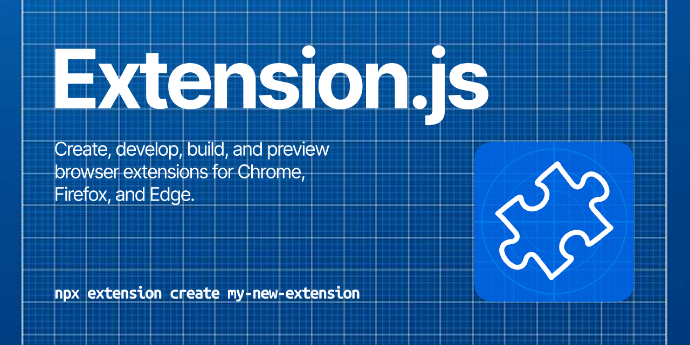

[](https://github.com/extension-js/extension.js.org/actions/workflows/ci.yml)

# Extension.js Docs

> The documentation website for Extension.js



Extension.js Docs is the documentation site for the cross-browser extension framework. It is built with [Rspress](https://rspress.dev/) and publishes the guides, references, workflows, and implementation notes for [Extension.js](https://extension.js.org).

- Read the docs: [extension.js.org](https://extension.js.org)
- Explore the framework: [extension-js/extension.js](https://github.com/extension-js/extension.js)
- Contribute to the framework: [CONTRIBUTING.md](https://github.com/extension-js/extension.js/blob/main/CONTRIBUTING.md)

## Run locally

Install dependencies:

```sh
pnpm install
```

Start the docs dev server:

```sh
pnpm dev
```

Build the site:

```sh
pnpm build
```

Preview the production build:

```sh
pnpm preview
```

## License

MIT (c) Cezar Augusto and the Extension.js authors.
